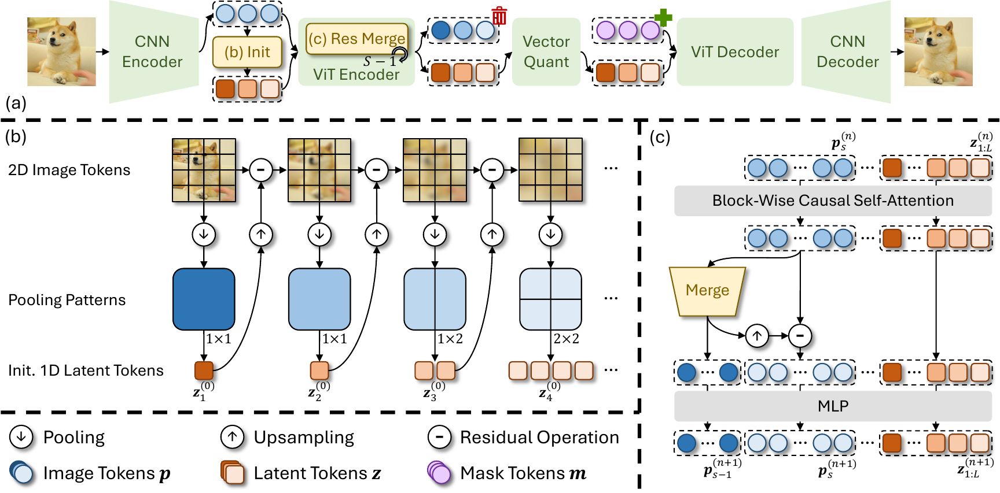

<h1 align="center"> ResTok: Learning Hierarchical Residuals in 1D Visual Tokenizers for Autoregressive Image Generation </h1>

<p align="center">
  <a href='https://arxiv.org/abs/2601.03955'>
  </a> 
  <a href='https://huggingface.co/xushu-me/restok_l_128.r256_in1k'>
  </a>
  <a href='https://huggingface.co/xushu-me/llamagen_l_c2i_restok_l_128.r256_in1k'>
  </a>
  <a href='https://visitor-badge.laobi.icu/badge?page_id=Kwai-Kolors.ResTok'>
  </a> 
</p>

<div align="center">
  <a href="https://scholar.google.com/citations?user=-ZhpHg0AAAAJ" target="_blank">Xu&nbsp;Zhang</a><sup>1*</sup> &ensp; <b>&middot;</b> &ensp;
  <a href="https://scholar.google.com/citations?hl=en&user=A1FqXioAAAAJ&view_op=list_works" target="_blank">Cheng&nbsp;Da</a><sup>2</sup> &ensp; <b>&middot;</b> &ensp;
  <a href="https://hyang0511.github.io/" target="_blank">Huan&nbsp;Yang</a><sup>2&dagger;</sup> &ensp; <b>&middot;</b> &ensp;
  <a href="https://scholar.google.com/citations?user=PXO4ygEAAAAJ" target="_blank">Kun&nbsp;Gai</a><sup>2</sup> &ensp; <b>&middot;</b> &ensp;
  <a href="https://scholar.google.com/citations?user=qDtMMVgAAAAJ&hl" target="_blank">Ming&nbsp;Lu</a><sup>1✉</sup> &ensp; <b>&middot;</b> &ensp;
  <a href="https://scholar.google.com/citations?user=78KxtRMAAAAJ&hl" target="_blank">Zhan&nbsp;Ma</a><sup>1</sup><br>
  <sup>1</sup>Vision Lab, Nanjing University &emsp; <sup>2</sup>Kolors Team, Kuaishou Technology &emsp; <br>
  <sup>*</sup>Work done while interning at Kuaishou Technology. &emsp; <sup>&dagger;</sup>Project lead. &emsp; <sup>✉</sup>Corresponding author. &emsp; <br>
</div>
<br>

<p align="center">

</p>


## 📝 News

* [2026.01.31]: 🔥 The source code and pre-trained models are publicly available!


## 📖 Introduction

This repository contains the official PyTorch implementation of the paper “[ResTok: Learning Hierarchical Residuals in 1D Visual Tokenizers for Autoregressive Image Generation](https://arxiv.org/abs/2601.03955)” paper.

<p align="center">

</p>

Existing 1D visual tokenizers for autoregressive (AR) generation largely follow the design principles of language modeling, as they are built directly upon transformers whose priors originate in language, yielding single-hierarchy latent tokens and treating visual data as flat sequential token streams. However, this language-like formulation overlooks key properties of vision, particularly the hierarchical and residual network designs that have long been essential for convergence and efficiency in visual models.

To bring "vision" back to vision, we propose the Residual Tokenizer (ResTok), a 1D visual tokenizer that builds hierarchical residuals for both image tokens and latent tokens. The hierarchical representations obtained through progressively merging enable cross-level feature fusion at each layer, substantially enhancing representational capacity. Meanwhile, the semantic residuals between hierarchies prevent information overlap, yielding more concentrated latent distributions that are easier for AR modeling. Cross-level bindings consequently emerge without any explicit constraints. To accelerate the generation process, we further introduce a hierarchical AR generator that substantially reduces sampling steps by predicting an entire level of latent tokens at once rather than generating them strictly token-by-token. Extensive experiments demonstrate that restoring hierarchical residual priors in visual tokenization significantly improves AR image generation, achieving a gFID of 2.34 on ImageNet-256 with only 9 sampling steps.


## 🛠️ Usage

### 1. Preparation

```bash
conda create -n restok python=3.10
conda activate restok
pip install torch==2.6.0 torchvision==0.17.2 --index-url https://download.pytorch.org/whl/cu126

git clone https://github.com/Kwai-Kolors/ResTok.git
cd ResTok
pip install -r requirements.txt
. scripts/set_env_vars.sh
```

### 2. Evaluation

Our pre-trained models are publicly available at the following links. You can download the model weights to a local directory and modify the corresponding checkpoint paths in the [config](./configs/infer/ResTok/llamagen_l_c2i_restok_l_128.yaml) for inference.

| Model             | Links                                                                                    | Performance | #Param. | 
|-------------------|------------------------------------------------------------------------------------------|-------------|---------|
| ResTok            | [Hugging Face](https://huggingface.co/xushu-me/restok_l_128.r256_in1k)                | rFID = 1.28 | 662M    |
| LlamaGen with HAR | [Hugging Face](https://huggingface.co/xushu-me/llamagen_l_c2i_restok_l_128.r256_in1k) | gFID = 2.34 | 326M    |

Before evaluating generation, please refer [evaluation readme](evaluations/c2i/README.md) to install required packages.

```bash
# Evaluating reconstruction
CUDA_VISIBLE_DEVICES=0 PYTHONPATH=. WANDB_MODE=offline accelerate launch --num_machines=1 --num_processes=1 --machine_rank=0 --main_process_ip=127.0.0.1 --main_process_port=9999 --same_network --dynamo_backend=no scripts/test_restok.py config=configs/infer/ResTok/llamagen_l_c2i_restok_l_128.yaml

# Evaluating generation
bash scripts/sample_c2i_search_cfg.sh --config configs/infer/ResTok/llamagen_l_c2i_restok_l_128.yaml --precision "none" --per-proc-batch-size 50 --cfg-scale 3.75 --cfg-schedule "step" --step-start-ratio 0.25 --top-p 0.95 --gt-npz-path "VIRTUAL_imagenet256_labeled.npz" --num-fid-samples 50000
```

### 3. Training

We use [webdataset](https://github.com/webdataset/webdataset) format for data loading. To begin with, it is needed to convert the dataset into webdataset format. You can get the converted dataset directly from [hugging face](https://huggingface.co/datasets/timm/imagenet-1k-wds). Alternatively, you can manually convert ImageNet to wds format via an example script provided [here](./dataset/convert_imagenet_to_wds.py).

We provide example commands to train ResTok and LlamaGen as follows:
```bash
# Training for ResTok
PYTHONPATH=. WANDB_MODE=offline accelerate launch --num_machines=1 --num_processes=8 --machine_rank=0 --main_process_ip=127.0.0.1 --main_process_port=9999 --same_network scripts/train_restok.py config=configs/training/ResTok/restok_l_128.yaml \
    training.per_gpu_batch_size=32 \
    training.gradient_accumulation_steps=1

# (Optional) Extracting codes for LlamaGen
bash scripts/extract_codes_c2i.sh \
    --data-path ${PATH_TO_IMAGENET} \
    --code-path "./pretokenization/restok_l_128_run1/" \
    --batch-size 16 \
    --model-config "./configs/infer/ResTok/llamagen_l_c2i_restok_l_128.yaml" \
    --ten-crop \
    --crop-range 1.1 \
    --resume

# Training for LlamaGen
PYTHONPATH=. WANDB_MODE=offline accelerate launch --num_machines=1 --num_processes=8 --machine_rank=0 --main_process_ip=127.0.0.1 --main_process_port=9999 --same_network scripts/train_llamagen_restok.py config=configs/training/generator/llamagen_l_c2i_restok_l_128.yaml \
    training.per_gpu_batch_size=32 \
    training.gradient_accumulation_steps=1 \
    experiment.tokenizer_checkpoint=${PATH_TO_RESTOK_WEIGHT}
```

You can set "WANDB_MODE=online" to support online wandb logging, if you have configured it.


## ⭐ Citation

If you find this repository helpful, please consider giving it a star ⭐ and citing:
```bibtex
@article{zhang2026restok,
  title={ResTok: Learning Hierarchical Residuals in 1D Visual Tokenizers for Autoregressive Image Generation},
  author={Zhang, Xu and Da, Cheng and Yang, Huan and Gai, Kun and Lu, Ming and Ma, Zhan},
  journal={arXiv preprint arXiv:2601.03955},
  year={2026}
}
```


## 🤗 Acknowledgments

This codebase is built upon the repositories of [TiTok](https://github.com/bytedance/1d-tokenizer) and [LlamaGen](https://github.com/FoundationVision/LlamaGen). The code of representation alignment is based on [VA-VAE](https://github.com/hustvl/LightningDiT). The evaluation is also based on [GigaTok](https://github.com/SilentView/GigaTok). Thanks for their great work!
